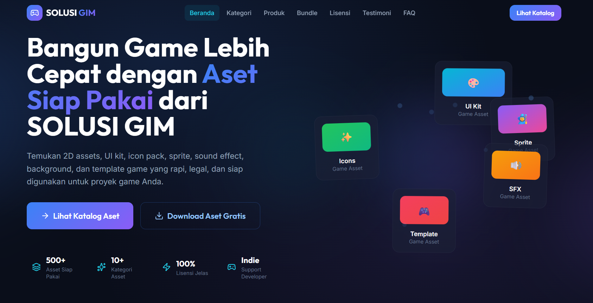

# SOLUSI GIM

> Marketplace aset game digital untuk developer indie Indonesia.

[](https://solusi-gim.vercel.app)
[](https://react.dev)
[](https://vite.dev)
[](https://tailwindcss.com)
[](https://www.framer.com/motion)

---

A modern landing page for a digital game asset marketplace built with **React 19**, **Vite**, **Tailwind CSS**, and **Framer Motion**. Features 14 interactive sections including product catalog, bundle system, licensing info, testimonials, FAQ, and asset request functionality — designed to empower indie game developers in Indonesia with ready-to-use, high-quality game assets.

## Preview



> Tampilan halaman utama SOLUSI GIM — hero section dengan floating card animasi.

## Demo

| Link | URL |
|------|-----|
| **Live Demo** | [solusi-gim.vercel.app](https://solusi-gim.vercel.app) |
| **Repository** | [github.com/aryomulyadi/solusi-gim-landing-page](https://github.com/aryomulyadi/solusi-gim-landing-page) |

## Features

- **Hero Section** — Animasi floating card, trust stats, CTA ganda
- **Problem & Solution** — Copywriting yang menyasar pain point developer indie
- **Kategori Produk** — Filter 8 kategori aset game
- **Katalog Produk** — Grid aset dengan detail lisensi & harga
- **Bundle Pack** — Paket hemat dengan harga spesial
- **Cara Kerja** — Step-by-step panduan transaksi
- **Lisensi** — Penjelasan skema lisensi aset
- **Testimoni** — Social proof dari pengguna
- **Lead Magnet** — Download aset gratis
- **FAQ** — Accordion pertanyaan umum
- **Request Asset** — Form permintaan aset kustom
- **Final CTA** — Call-to-action penutup
- **Footer** — Navigasi lengkap, kontak, & tim pengembang

## Tech Stack

| Teknologi | Kegunaan |
|-----------|----------|
| **React 19** | UI framework |
| **Vite 8** | Build tool & dev server |
| **Tailwind CSS 3** | Utility-first styling |
| **Framer Motion 12** | Animasi & transisi |
| **Lucide React** | Icon set |
| **ESLint** | Code linting |

## Project Structure

```
src/
├── components/
│   ├── layout/          # Navbar, Footer
│   ├── sections/        # 14 sections landing page
│   └── ui/              # Button, Card, Badge, dll.
├── data/                # Data dummy (produk, kategori, bundle, dll.)
├── hooks/               # Custom hooks (scroll, scroll spy)
├── utils/               # Utility (WhatsApp URL)
├── App.jsx              # Root component
└── main.jsx             # Entry point
```

## Getting Started

```bash
git clone https://github.com/aryomulyadi/solusi-gim-landing-page.git
cd solusi-gim-landing-page

npm install
npm run dev

# Build for production
npm run build
npm run preview
```

## Team

| Name | NIM |
|------|-----|
| Rifqi Aryo Mulyadi | 23.11.5646 |
| Zakki Maulana | 23.11.5686 |
| Raditya M. W. H | 23.11.5668 |

## License

Copyright © 2026 **SOLUSI GIM**. All rights reserved.

Proyek ini dikembangkan sebagai bagian dari tugas pengembangan web — Toko Aset Game Digital.
